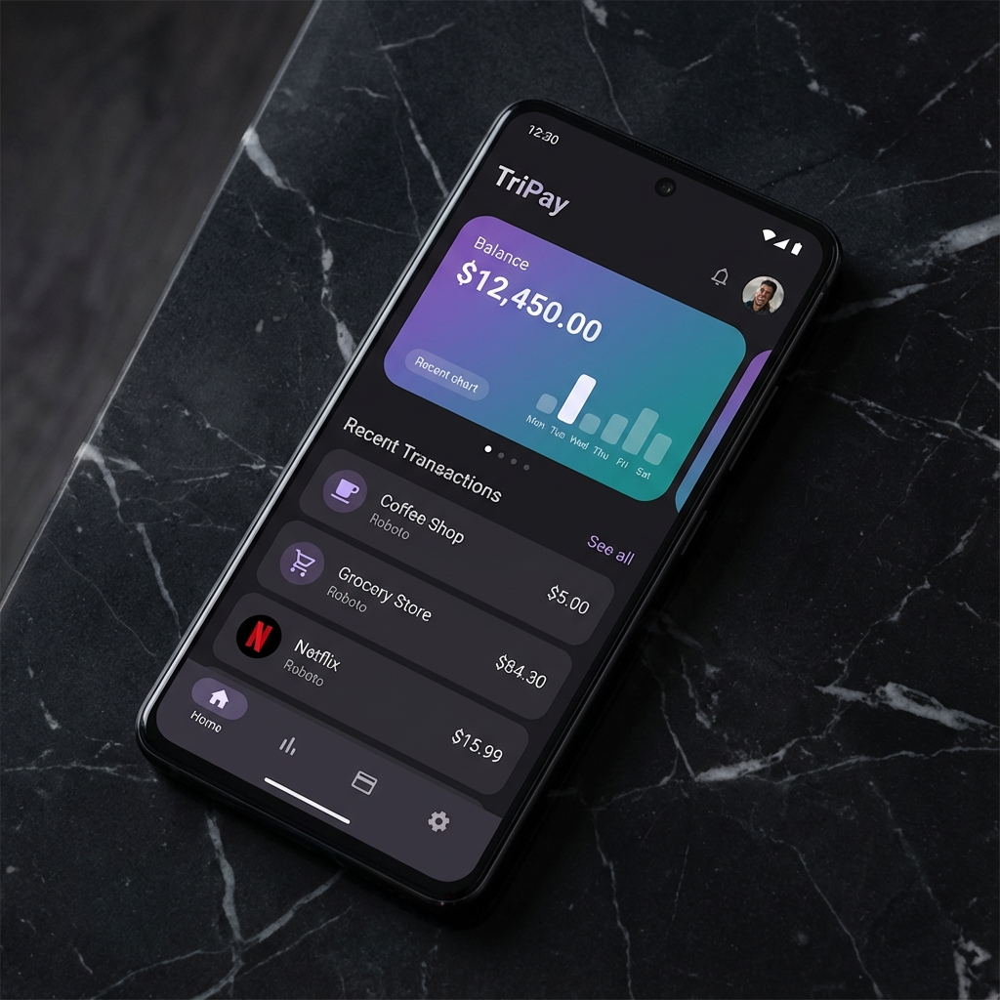
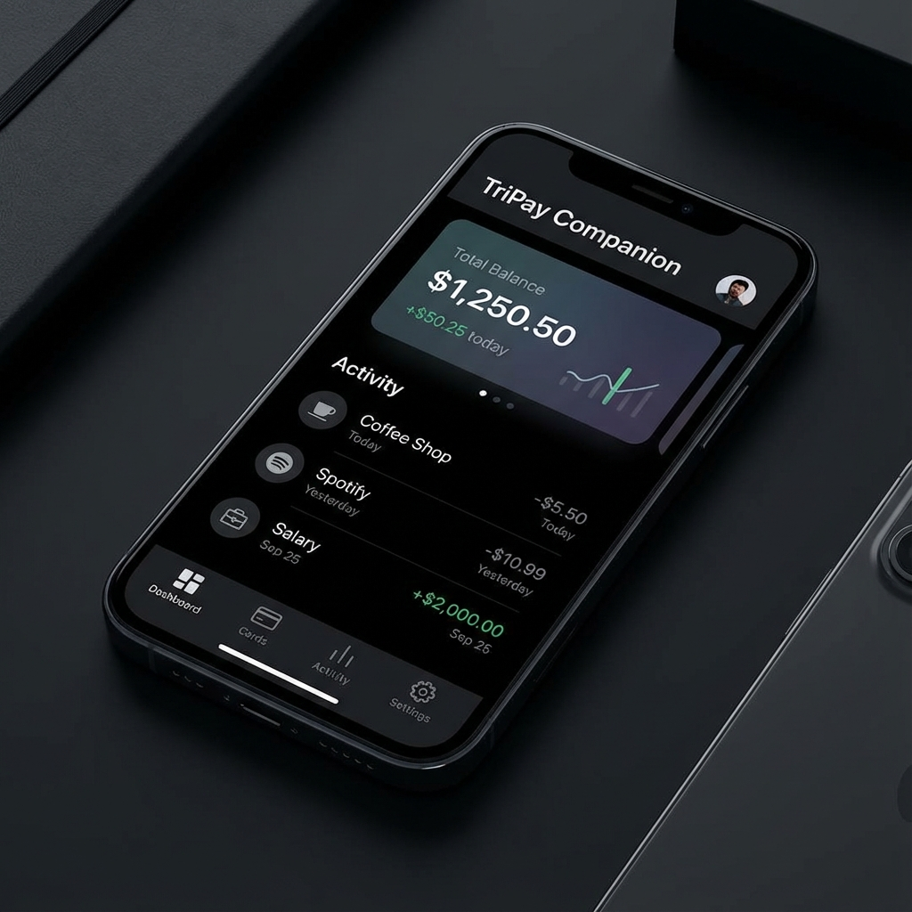
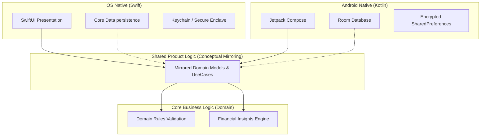

# TriPay: Offline-First Elite Smart Finance App 📱💰

TriPay is a production-grade personal finance application showcasing an **Elite Mobile Engineering Stack**. It features native **iOS (SwiftUI)**, native **Android (Jetpack Compose)**, and a **Flutter (Dart)** companion app, all built with **Clean Architecture** and a focus on **Offline-First** reliability.

 <!-- Update with a real banner if needed -->

## 🚀 The "Elite" Difference
Unlike standard mobile projects, TriPay is engineered for the industry. It demonstrates professional patterns that recruiters and senior engineers look for:

- **Clean Architecture**: Domain-driven design with strict layer boundaries.
- **Offline-First Engine**: Full local persistence with hardware-backed encryption.
- **Bespoke Sync Engine**: Custom state machine for background data synchronization and conflict resolution.
- **Mathematical Parity**: Mirrored analytical engines ensuring identical results across Swift and Kotlin.

---

## 🎨 Professional UI Showcase

| iOS (SwiftUI) | Android (Jetpack Compose) | Flutter (Companion) |
| :---: | :---: | :---: |
|  |  |  |

---

## 🏗️ High-Level Architecture

TriPay follows the **Clean Architecture** principles, ensuring that the business logic (Domain) remains independent of UI frameworks and data persistence layers.

---

## 🛠️ Technical Depth

### 1️⃣ Native iOS Mastery (Swift)
- **UI**: 100% SwiftUI with advanced animations and Live Activities support.
- **Persistence**: Core Data with SQLCipher for encrypted local storage.
- **Security**: Hardware-backed biometric authentication (Face ID / Touch ID).
- **Concurrency**: Structured concurrency using `async/await` and `TaskGroups`.

### 2️⃣ Native Android Mastery (Kotlin)
- **UI**: Jetpack Compose using Material 3 design system.
- **Persistence**: Room Database with multi-threading support via Coroutines.
- **Deep Integration**: Android WorkManager for guaranteed background sync.
- **Security**: BiometricPrompt API and EncryptedSharedPreferences for sensitive tokens.

### 3️⃣ Cross-Platform Utility (Flutter)
- **Role**: Lightweight companion app for rapid read-only data access.
- **Persistence**: High-speed local caching using Hive.
- **Design**: Material + Cupertino adaptation for a truly native feel on any OS.

---

## 🔄 The Sync & Conflict Engine
TriPay implements a production-ready sync strategy:
- **States**: `Local-Only`, `Pending-Sync`, `Synced`, and `Conflict`.
- **Resolution**: Weighted timestamp-based resolution with a manual override UI.
- **Observability**: Built-in structured logging and a hidden **Internal Debug Panel** for real-time state inspection.

---

## 🧪 Testing & Verification
- **Unit Tests**: Domain logic parity tests between Swift and Kotlin.
- **Integration Tests**: Sync state machine validation.
- **Performance**: Stress-tested for processing 10,000+ transactions on-device.

---

## 📁 Project Structure
- `/ios`: Native SwiftUI Project
- `/android`: Native Jetpack Compose Project
- `/flutter`: Cross-platform Companion App
- `shared_models.md`: Technical specification for data parity
- `PORTFOLIO.md`: Detailed engineering achievements summary

---

## 👨‍💻 Installation & Setup

### Prerequisites
- Xcode 15+ (for iOS)
- Android Studio Hedgehog+ (for Android)
- Flutter SDK (for Companion app)

### Setup
1. Clone the repository.
2. For iOS: `cd ios && open TriPay.xcodeproj`
3. For Android: Import the `android` folder into Android Studio.
4. For Flutter: `cd flutter && flutter pub get && flutter run`

---

## 📄 License
This project is licensed under the MIT License - see the [LICENSE](LICENSE) file for details.
